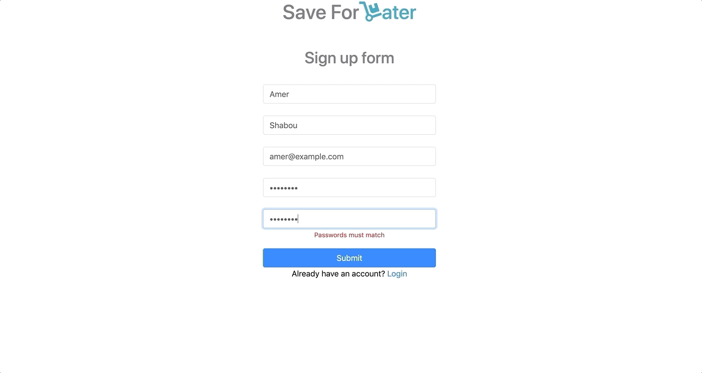
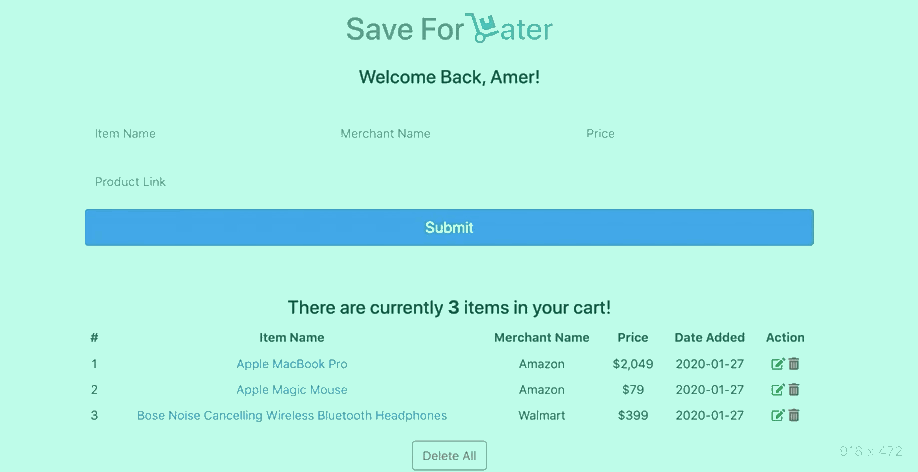

# Save-For-Later

> Web Application that helps people keep track of items they want to buy in the future. Delivered as a `Minimum Viable Product (MVP)`.

## Photos

### Signup




### Login



### Add


### Edit


### Delete one And Delete All


## Table of Contents

1. [Techs](#Techs)
1. [Usage](#Usage)
1. [Requirements](#requirements)
1. [Development](#development)

## Techs

- React
- Bootstrap
- Babel
- Webpack
- Express
- MongoDB
- Mongoose

## Usage

### Run Project Locally

Assumes local installation of [Node.js](https://nodejs.org/en/download/)

To run the project locally:

- Clone or fork this repository.
- Run `npm install`
- Run `npm run react-dev` (If you made chenges to any of the files)
- Run `npm run start`

## Requirements

An `nvmrc` file is included if using [nvm](https://github.com/creationix/nvm).

- Node 6.13.0
- etc

## Development

### Installing Dependencies

From within the root directory:

```sh
npm install -g webpack
npm install
```
